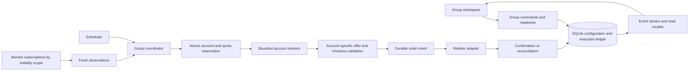

# Task groups: original architecture proposal

> Historical design notes. See [the implemented architecture and evaluation](task-group-implementation.md) for current behavior, measurements and limitations.

Status: design proposal, October 8, 2026. No production execution behavior or
existing groups are changed by this document. The user confirmed both continuous
restocks and scheduled releases as priorities; optimize for correct, explainable execution
before increasing throughput.

Open [the interactive screen concept](task-group-concept.html) to explore group
setup, Products / Accounts / Activity, a stock observation, quota reservation,
confirmation, pause and stopping. All data and actions there are simulated.

## The product decision

A task group should express one purchasing objective at one retailer and region:
**watch these products, use these accounts, act within these limits, during this
window**. Users should not need to manufacture repeated task rows to get work done.

Keep the familiar name **Task groups**. Replace manual task creation with account
assignment and explicit product goals. A task becomes a recorded execution attempt
created by the engine when an eligible observation can be assigned to an account.

Example: “Watch these three alternatives at Amazon US. Buy two units total, no
more than one per account, at most $80 per unit and $180 including shipping/tax.
Use these four accounts. Stop when two units are confirmed.” This is one group,
not four accounts times three products times an arbitrary task-count multiplier.

## What the current code actually does

| Finding | Evidence | Practical effect |
| --- | --- | --- |
| Each task creates its own monitor and scans the group's products | `retail/runner.py`, `TaskRunner.run`; `retail/adapters.py`, `MonitorService.scan` | Tasks with equivalent visibility repeat the same reads. With A concurrent accounts and P inputs, up to A × P monitor pages are opened, plus checkout pages and optional separate contexts. |
| Account lock and browser slot are acquired before monitoring, held until task exit | `retail/runner.py`, acquisition and `finally` blocks | A task that waits indefinitely monopolizes its account; queued duplicates are not extra effective purchasing capacity. |
| Group and task both contain quantity and retry fields | `retail/models.py`, `Group`, `Task` | Group defaults are copied at creation; changing them does not consistently change existing tasks. |
| `max_total` is checked per attempted order; success count is local to each task run | `retail/runner.py`, subtotal check and `successes` | A group has no aggregate spend or unit target. “Maximum checkouts” can be multiplied across tasks. |
| Most configuration is captured at run start; only monitor delay is refreshed in the loop | `retail/runner.py`, `latest` | The API permits some edits that do not uniformly affect running work. |
| UI leads with checkout profiles and task quantity | `static/redesign.js`, `createAssignedTasks` | Setup emphasizes machinery. Amazon still uses its own saved address/payment; profile assignment does not apply them. |
| State names mix resource waiting, stock waiting and outcome | `retail/task_state.py`, `waiting`, `in_queue`, `completed` | Filtered stock, quotes and purchases can be difficult to distinguish. |
| Local-time schedules coexist with individual task schedules | `retail/scheduling.py`, `Engine.schedule` | More scheduling surfaces and ambiguous device-time/DST behavior. |
| Dashboard downloads broad state and rebuilds views every 1.8 seconds | `static/app.js`, `refresh`; `retail/app.py`, `/api/state` | Large histories and frequent runtime changes eventually make the UI expensive and difficult to keep stable. |
| Submission intent is persisted before the final click | `retail/runner.py`, `submissions` | Valuable protection to retain and strengthen, not discard during an overhaul. |

Keep the account vault, fingerprint profiles, account/session tools, proxy
configuration, retailer parsing, cart and checkout validation, diagnostics,
simulation, purchase cooldowns, and existing browser tests. Amazon is currently
the only implemented live adapter; other retailers must remain clearly unavailable
for live execution until their capabilities exist.

## User experience

### Create a group

Use one setup panel with four short sections and progressive disclosure:

1. **Products:** name, retailer/region, paste links or IDs; resolve to product rows.
   Each row shows product, priority, maximum unit price and desired quantity.
   Paste/import stays supported. An input list is imported as a versioned snapshot,
   so editing a list elsewhere cannot silently change a running purchase plan.
2. **Accounts:** choose accounts or an account folder; preview the resolved roster
   and readiness. Use each account's saved browser, fingerprint and connection.
   Adding an account to that folder later does not silently join an active run.
   Show shipping/payment profile assignment only when the adapter actually applies it.
3. **Goal and limits:** Notify only, Prepare for review (default), or Automatic
   checkout. Choose “Any matching product” or “Each product.” Show units needed,
   units per order, per-account unit cap, maximum order total and group spend cap.
   “Get checkout total” belongs in advanced tools, not the primary purchase goal.
4. **Timing:** Start manually, One scheduled window, or Recurring windows.
   Continuous operation is manual start without an end time. A scheduled release
   adds optional preparation time before the execution window.

Show a plain-language plan summary and **Check readiness / Save group**. Readiness
reports blocking issues with a direct fix; it does not imply guaranteed checkout.
Live versus Simulation is an explicit group-run choice, visually prominent.
Simulation cannot call retailer mutation methods or share live quota counters.

Advanced settings contain polling interval, bounded monitor concurrency,
connection overrides, seller/condition filters, discount rules, offer IDs and
retailer-specific checkout preferences. Retry policy should normally be automatic
and explained through current status rather than exposed as several timing fields.

### Operating screen

Use the full content width; remove the permanently open settings column.

```text
Amazon US / Weekend restocks        LIVE · Watching       [Pause] [Stop] [Edit]
2 units requested · 0 confirmed · 1 reserved · $80 reserved of $180
4 accounts: 2 ready · 1 busy · 1 needs sign-in      Stock checked 3 seconds ago

Products                  Accounts                  Activity
Product         Price / cap      Stock      Goal       Last check / reason
Product A       $75 / $80         Eligible  0/2        Checkout reserved
Product B       $89 / $80         In stock  —          Above your price cap
Product C       — / $80           Unknown   —          Retry in 12 seconds

Attention (1): Account D needs sign-in                         [Open account]
```

- **Products** is the default view: availability, actual price, last observation,
  units confirmed/reserved, and the reason a product is not proceeding.
- **Accounts** shows readiness and current assignment, not duplicated monitor tasks.
- **Activity** shows attempts, order outcomes and significant events. Opening an
  attempt reveals its effective settings, timeline, browser and reconciliation.
- Show “No stock,” “Above limit,” “Cooling down,” “Waiting for an account,” and
  “Waiting for a browser slot” separately. Expected filter rejection keeps watching;
  it must not demand manual intervention on every polling cycle.
- Top-level actions are Start, Pause/Resume, Stop and Edit, with only applicable
  actions visible. Contextual actions are Inspect browser, Resolve and Retry when
  a retry is proven safe. No “retry all” for uncertain orders.
- Group list shows progress, health, mode and next start; color is secondary to labels.

## Domain model

Configuration and runtime records have different lifetimes. Do not keep mutable
execution state in the saved configuration object.

| Entity | Responsibility and essential fields |
| --- | --- |
| `TaskGroup` | Stable identity, name, retailer, region, enabled state, draft/current revision IDs. |
| `GroupRevision` | Immutable products, resolved roster rules, goal, limits, schedule, monitor policy, execution mode and source-list version. |
| `ProductTarget` | Canonical product/variant, optional offer, priority, unit-price cap, desired units when targeting each product. Belongs to a revision. |
| `AccountAssignment` | Eligible account, priority, per-account cap; explicit overrides only. Fingerprint and normal connection remain account-owned. |
| `GroupRun` | One activation/window: revision, resolved account roster, live/simulation mode, timestamps, state, quota-scope ID, stop generation. |
| `Observation` | Product/offer, visibility scope, observation time, price/currency, availability, seller/condition, source and expiry. Not a promise of stock. |
| `Attempt` | Run, target, account, observation reference, effective configuration snapshot, lifecycle, typed reason, owner/lease, timestamps. |
| `Reservation` | Units and conservative money allowance held against product, account and group quota, linked to an attempt. |
| `OrderIntent` | Durable submission identity and state, final verified checkout snapshot, submission boundary and reconciliation outcome. Never recycled for another order. |
| `ExecutionEvent` | Sequence, run/attempt reference, typed event and sanitized payload for history and UI updates. |

Use integer minor currency units, not binary floating point, for prices and budgets.
One group uses one currency/region; no implicit currency conversion. Per-item caps
refer to unit price; order and group caps include the verified final total.

Precedence is explicit: system capacity limits > group budget/goal constraints >
product and account caps. A narrower override may tighten a cap, never bypass a
group cap. Task group defaults select account behavior; accounts retain identity
and connection settings. Resolve and record the complete effective configuration
at attempt creation. Revalidate current account availability/cooldown before action.

“Any matching product” uses one shared unit target. “Each product” has a unit target
per row plus the overall spending ceiling. Default selection is target priority,
then oldest eligible opportunity; account selection is fair round-robin among ready
accounts. Explicit priorities are advanced. Default units per order is one, further
bounded by all remaining quotas and retailer availability.

## Execution architecture



Stay a **single local application with well-separated modules**, FastAPI, asyncio
and SQLite. Suggested package: `retail/task_groups/` with domain, repository,
planning, monitoring, coordination, scheduling and execution modules. Keep retailer
adapters outside orchestration. No distributed broker is needed for this scope.

### Monitoring

Subscriptions key on retailer, region, canonical product/variant and visibility
scope: delivery area, membership/eligibility, account/session when required, and
connection policy. Share observations only across compatible subscriptions.

The current Amazon browser adapter is account-bound. Initially deduplicate only
within verified equivalent scopes; do not assume anonymous monitoring or share
personalized offers across all accounts. Add broader sharing only after adapter
tests establish it. Monitoring is read-only and never transfers cookies between
accounts. When a browser-bound monitor needs an account already checking out,
pause that account's reads or use a separately validated read session policy.

Use a bounded page pool, not one permanent page for every input. Schedule the next
inspection from its prior start and the allowed cadence, with bounded concurrency
and retailer backoff. There is at most one in-flight inspection per subscription.
Coalesce repeated observations; a changed price/offer/availability updates the
opportunity rather than generating unlimited jobs. Expired observations require
refresh. Worker-side revalidation is mandatory even with a fresh monitor result.

### Coordination, budgets and workers

For an eligible observation, the coordinator checks window, run generation,
remaining target, account readiness/cooldown and capacity. In one short transaction
it claims the account, creates an attempt, and reserves units plus a conservative
order allowance. Reserve up to the allowed maximum for that order, not merely the
observed item subtotal; shipping/tax must not cause concurrent budget overspend.

Account mutation is exclusive across every group and manual account browser.
Allocate account and worker capacity together; waiting attempts hold neither a
long-lived browser slot nor an account checkout lock. A database account claim is
the authority; in-memory locks are optimizations. Waiting for stock does not
consume checkout capacity. Paused manual checkout retains account exclusivity
and a bounded attention-browser slot because its cart is still active.

Use one physical browser/process capacity governor with separate monitor,
preparation and checkout priorities. A native profile may cost a full process;
capacity is based on actual resources, not the number of visible task rows.
Admission control prevents monitor work from consuming all checkout capacity.

At final review, require verified product, seller, condition, quantity, currency,
final total and appropriate account session. In a transaction adjust the money
reservation to that total and persist the order intent **before** submitting.
Confirmation consumes reserved units and actual spend once. Proven pre-submit
failure releases reservations. Unknown cart effects quarantine the account until
checked; unknown submission effects retain reservations until reconciliation.

At-most-one automatic submission attempt per intent is the local guarantee.
Exactly-once ordering cannot be guaranteed across a browser and retailer without
retailer-side idempotency. A timeout, crash or stop around the click becomes
`reconciliation_required`, never an automatic new purchase attempt. Expired worker
leases do not release post-mutation reservations or grant a replacement worker
permission to submit. Lease generations fence stale workers before every mutation.

Review mode never automatically clicks Place Order. It still reserves quotas;
manual completion is reconciled before another account gets that quota. Quote
mode can change the cart, so it needs an account claim and cart reconciliation,
although it never consumes a purchase goal as a confirmed order.

### States, errors and stopping

Group states: Draft, Ready, Scheduled, Preparing, Watching, Paused, Stopping,
Completed, Stopped, Needs attention. A group can keep watching while one account
needs attention; health is a separate aggregate, not a replacement for lifecycle.

Attempt states: Reserved → Preparing → Revalidating → Carting → Reviewing →
Submitting → Confirmed. Branches are Waiting for user, Retry scheduled, Rejected,
Cancelled, Failed, and Reconciliation required. Use typed reason codes, not message
substring matching. Out of stock/price rejection is normal monitoring, not failure.

Only read-only/transparently pre-mutation failures retry automatically with bounded
backoff. Authentication recovery keeps the same account ownership. Access denials
and challenges pause for review under the existing policy; no proxy rotation to
work around explicit retailer blocks. Slow/blocked accounts do not stall others.

**Pause** stops new assignments and freezes pre-submit attempts before their next
mutation. Already-started submissions proceed only to outcome observation.
**Stop** additionally cancels waiting work, unsubscribes monitoring, and closes
idle contexts. It cannot undo a retailer order. A durable generation change is
checked immediately before mutation; in-flight operations at the boundary are
classified and reconciled. “Stopping: checking one order outcome” is more accurate
than an immediate green “Stopped.” Global stop uses the same mechanism.

### Scheduling and preparation

Schedules store an IANA timezone, windows, recurrence and optional preparation lead
time. Show both scheduled timezone and next local occurrence. Persist a unique
occurrence identity. Define DST behavior: skip nonexistent local starts with a
visible warning; run a repeated local start only once. Store the chosen UTC bounds.

Preparation verifies sessions and warms a bounded number of account browsers;
it does not cart or submit before the execution window. Warm sessions expire and
are revalidated when used. Continuous groups prepare on demand. A window deadline
stops new assignments and freezes pre-submit attempts; already-started submissions
are reconciled. A scheduled launch is not a guarantee of stock or exact checkout time.

Stopping/restarting an ongoing run preserves quota history. Manual Start must not
reset completed or uncertain purchases. A completed goal requires an explicit new
run/goal allocation. Recurring schedules show **per-window** versus **whole-group**
quotas clearly; default purchase goals are whole-group so the next window cannot
silently repeat a completed objective. Per-window goals are an explicit option.

On application restart, recover configuration and observations, reconcile any
mutating attempts, and require explicit resume for live purchasing by default.
Optional auto-resume applies only to explicitly configured eligible groups and
never replays uncertain submissions. Missed windows are shown, not executed late.

## Persistence and API

The encrypted `records` store is useful for secrets/configuration, but individual
`Store.put` calls cannot atomically reserve multiple limits. Add an execution
repository with explicit transactions, indexed operational tables, unique intent
keys, account ownership and version-checked updates. Keep sensitive snapshots
encrypted; plaintext indexes contain only opaque IDs, state and scheduling keys.
If budget counters are encrypted, compare/update them inside the same serialized
transaction. Never perform browser/network work while holding that transaction.

SQLite supports one writer at a time; use short `BEGIN IMMEDIATE` transactions and
bounded busy handling. WAL helps reads coexist with writes, not parallel writers.
Use a single scheduler owner per local database and prevent a second app instance
from operating the same workspace. See [SQLite transactions](https://www.sqlite.org/lang_transaction.html)
and [WAL documentation](https://www.sqlite.org/wal.html).

Suggested API contracts:

- `POST /api/task-groups/preview`: validate a proposed revision and show resolved
  products, roster, limits, readiness and unsupported capabilities; no mutations.
- `POST /api/task-groups`; `PATCH /api/task-groups/{id}` with an expected revision.
- `POST /api/task-groups/{id}/runs`: explicit revision, mode and idempotency key.
- `POST /api/group-runs/{id}/pause|resume|stop`: idempotent commands with generation.
- `GET /api/group-runs/{id}`: compact progress/read model.
- `GET /api/group-runs/{id}/attempts?cursor=...`: paginated execution history.
- `POST /api/attempts/{id}/resolve`: record a verified outcome with evidence; never
  treat clicking Resolve as proof that no order exists.
- `GET /api/execution-events`: one dashboard event stream, persisted event IDs,
  bounded replay and a snapshot fallback when a cursor expires.

Commit events with their state changes. The stream publishes committed records;
client reconnect/replay must be harmless. Keep mutations as HTTP commands and
one-way updates as SSE; browsers support event IDs/reconnection as described in
[MDN's SSE documentation](https://developer.mozilla.org/en-US/docs/Web/API/Server-sent_events/Using_server-sent_events).
The server enforces the existing loopback/origin protections and exposes sanitized
events. Start with compact polling during migration; SSE is not a prerequisite for
correct scheduling. Update rows incrementally without replacing active editors.

Running configuration is immutable. Edits create the next revision. Apply a new
revision only after pausing/draining affected work; show pending changes. Labels
and display color can change immediately. No special half-live price/budget edits.

## Migration and implementation order

1. **Execution foundation:** typed errors/states, effective configuration snapshots,
   atomic reservations/intents, crash recovery and single-workspace ownership.
   Wrap existing cart/checkout code; keep the current UI usable.
2. **Group coordinator:** introduce goals, resolved roster and monitor subscriptions;
   move waiting for stock out of long-lived checkout tasks. Start with Amazon's
   existing visibility constraints. Verify shared checks and account exclusivity.
3. **Group workspace:** Products / Accounts / Activity, setup panel, readiness,
   progress and stop reasons. Remove task count from new-group setup. Add timed
   preparation and explicit quota/window behavior on the same coordinator.
4. **Migration and rollout:** preview conversion, migrate idle groups, run simulations,
   then review-mode fixtures and opt-in live operation. Add event streaming and
   additional retailer adapters only after the execution model is stable.

Legacy conversion must not reinterpret a per-order limit as a historical group
spend allowance. Preserve old maximum order total. Require a deliberate group goal
and spending cap before automatic purchasing. Collapse duplicate task rows into
account assignments without treating their count as desired purchases. Mixed
behaviors/quantities are shown as conflicts or split into clearly named groups;
do not silently choose one. Existing submission records remain authoritative and
link into reconciliation. Conflicting task/group schedules require resolution.

Migrate only stopped groups. Make a database backup, version the schema, retain old
IDs in a migration map and keep legacy data readable. Never run old and new engines
on the same group simultaneously. Rollback may restore the old interface, but it
must not erase new submission intents or permit old tasks to duplicate them.

## Acceptance criteria

- Twenty assignments watching five identical products in one validated visibility
  scope produce five monitor inspections per cycle, not one hundred. Separate
  scopes stay isolated; every purchasing account still revalidates.
- Duplicate observations, repeated Start commands and reconnects cannot create
  duplicate claims for one remaining goal unit.
- Concurrent attempts cannot exceed units, account caps, order caps or group spend;
  unknown outcomes retain their reservation. Exercise two writers in tests.
- A continuously monitoring account cannot hold the checkout pool indefinitely.
  A blocked account does not prevent unrelated accounts/groups from progressing.
- Fault injection before/after cart, intent commit, click and confirmation never
  creates an automatic duplicate submission after restart.
- Price rejection, out-of-stock, backoff, unavailable capacity and authentication
  each produce different, useful UI reasons.
- Pause, stop, deadline and global stop prevent new mutations after their boundary;
  in-flight outcomes are reported truthfully. Stale workers cannot regain authority.
- DST, repeated windows, missed windows, restart and quota-scope resets are tested
  with an injected clock, not long real-time sleeps.
- Simulation cannot invoke live mutations; quote and review outcomes cannot count
  as confirmed purchases without verification.
- A user can create a simple restock group with products, accounts, limits and
  timing without touching advanced settings or creating task rows manually.

Measure observation age, observation-to-dispatch delay, account/session preparation
time, checkout queue delay, active browsers, redundant inspections, rejection
reasons and confirmed outcomes. Compare these against the current implementation
on fixed local fixtures. Establish machine-specific capacity from measurements;
do not promise a speed or retailer acceptance improvement from architecture alone.
